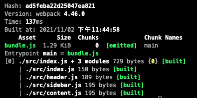

# 如何安装&配置webpack(保姆级教程)
> 📢注意：
> 本文仅适用于macOS，webpack@4.46.0
## 环境准备
### 安装nodejs
推荐去[nodejs官网](https://nodejs.org/zh-cn/download/)下载stable版本。`npm`作为nodejs包管理工具在安装nodejs的时候已经顺带装好了。
> 📢注意：
> 保持nodejs和webpack的版本尽量的新，可以提升webpack打包速度🚀。
### 更新nodejs
如果是之前安装过但是想更新一下nodejs版本，可以使用`n`模块。
- `node -v`首先查看当前node版本
- `npm info node`可以查看node版本信息
- `npm install -g n`安装`n`模块
- `sudo n stable`安装最新的**稳定**版本
- `sudo n latest`或者安装最新版本
### 更新npm
如果需要更新npm可以`sudo npm install npm@latest -g`
### 项目创建及初始化
- `mkdir webpack-demo`首先创建一个文件夹
- `cd webpack-demo`进入到文件夹下
- `npm init`初始化项目，使项目符合nodejs的规范，也可以用`npm init -y`。这一步会在文件夹中生成`package.json`，这个文件描述了node项目的一些信息。
### 一些package.json的配置
- `"private": true,`项目是私有的，不会被发布到npm线上仓库
- 可以去掉`"main": "index.js",`，如果项目只是自己来用，没有必要向外暴露一个index.js文件
- `scripts`里面的内容也可以先去掉
## webpack安装&卸载
- 全局安装(一般不推荐)
  `npm install webpack webpack-cli -g`
  `webpack-cli`作用：可以使我们在命令行中正确运行`webpack`这个命令
- 全局卸载
  `npm uninstall webpack webpack-cli -g`
- 在项目中安装(🔥推荐)
  `npm install webpack webpack-cli -D`
- 在项目中安装查看webpack版本号
  `npx webpack -v`
- 查看webpack历史版本
  `npm info webpack`
- 安装指定版本webpack
  `npm install webpack@4.46.0 webpack-cli -D`
## webpack配置
前文[webpack究竟是什么](https://juejin.cn/post/7025628553920118820)我们提到过webpack是一个模块打包工具，会帮助我们把模块打包到一起。然而webpack并没有智能到我们给出一个文件它就知道如何打包，所以需要我们填写一个配置文件告诉webpack该如何打包。而之前执行`npx webpack ./index.js`进行打包使用的则是webpack给我们提供的默认配置文件。
### 配置过程
- `touch webpack.config.js`创建webpack默认配置文件
- 配置`webpack.config.js`
  ```json
  // webpack.config.js
  const path = require('path');
  module.exports = {
    mode: 'production',
    entry: './src/index.js',
    output: {
      filename: 'bundle.js',
      path: path.resolve(__dirname, 'dist')
    }
  }
  ```
- 默认模式为`mode: 'production'`，不配置的话打包会有warning。`mode`是`production`则打包出的文件会被压缩，如果`mode`为`development`，则不会被压缩。
- `entry`的意思是我们这个项目要做打包，从哪一个文件开始打包。打包输出中`Chunk Names`配置的`main`就是`entry`中的`main`。不简写的情况下为
  ```json
  entry: {
    main: './index.js'
  }
  ```
  
- `output`的意思是打包后的文件放在哪里
  - `filename`打包后的文件名
  - `path`指打包后的文件放到哪一个文件夹下，是一个绝对路径。需要引入node中的path模块,然后调用这个模块的resolve方法
  - `__dirname`指的是`webpack.config.js`所在的当前目录这个路径
  - `path: path.resolve(__dirname, 'bundle')`resolve方法把`__dirname`与自定义的打包后文件夹`bundle`结合，就生成`bundle`这个文件夹的绝对路径。

上述即为webpack标准配置文件，要求webpack从`index.js`开始打包，打包生成的文件放到`bundle`文件夹下，生成的文件名叫`bundle.js`。
运行`npx webpack`则会按照配置文件进行打包。
webpack默认配置文件名为`webpack.config.js`，如果要使用自定义名字比如`webpackcon.js`作为配置文件，可以用指令`npx webpack --config webpackcon.js`来实现。
  
## 配置package.json
```json
"scripts": {
    "bundle": "webpack"
  },
```
当运行`bundle`这个命令，则会自动执行`webpack`命令。于是可以直接运行`npm run bundle`进行webpack打包。
`npm` `scrtpts`原理：当执行`npm run bundle`时，实际上运行的是package.json中的bundle命令。在scripts标签中使用webpack，会优先去当前项目的node_modules中查找是否安装了webpack（和直接使用webpack命令是去全局查找是否安装webpack不同）
- 把index.html文件放到dist目录中并修改index.html中bundle.js的引入路径。

[webpack gei started](https://v4.webpack.js.org/guides/getting-started/https://v4.webpack.js.org/guides/getting-started/)