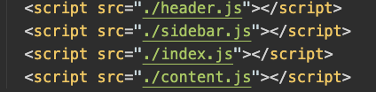
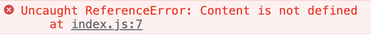
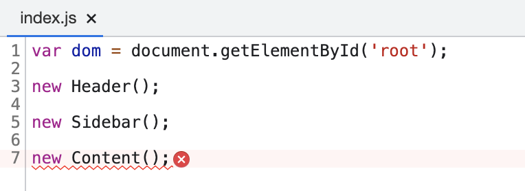

# webpack究竟是什么

## 面向过程
`index.html`
```html
<p>hello world</p>
<div id="root"></div>
<script src="./index.js"></script>
```
`index.js`
```javascript
var dom = document.getElementById('root');

var header = document.createElement('div');
header.innerText = 'header';
dom.append(header);

var sidebar = document.createElement('div');
sidebar.innerText = 'sidebar';
dom.append(sidebar);

var content = document.createElement('div');
content.innerText = 'content';
dom.append(content);
```
如上代码，如果按照面向过程来写代码，所有的js逻辑都堆在一个文件里，这样文件会越来越大，最终变得不可维护。

## 面向对象
`index.html`
```html
<p>面向对象</p>
  <div id="root"></div>
  <script src="./header.js"></script>
  <script src="./sidebar.js"></script>
  <script src="./content.js"></script>
  <script src="./index.js"></script>
```
在一个`index.html`中引入了多个js文件，首先会使整个页面加载速度变慢（浏览器每次处理`<script>`标签，都会让页面等待脚本的解析和执行）
`index.js`
```javascript
var dom = document.getElementById('root');

new Header();
new Sidebar();
new Content();
```
从`new Header();`中看不出对应的文件（地址）是哪一个。
不仅如此，也很难排查错误。
将`<script src="./content.js"></script>`如下图颠倒顺序


发现控制台报错


具体查看只追溯到`index.js`，对于新手来说不能轻易排查错误。


综上，按照上述方式进行面向对象编程，代码会变得不容易维护。
## 模块引入
### ES Modules 模块引入方式
`index.html`
```html
<p>面向对象</p>
<div id="root"></div>
<script src="./index.js"></script>
```
`index.js`
```javascript
import Header from './header.js';
import Sidebar from './sidebar.js';
import Content from './content.js';

var dom = document.getElementById('root');

new Header();
new Sidebar();
new Content();
```
### 使用 CommonJS 模块引入方式
模块引入
```javascript
const Header = require('./header');
```
模块导出
```javascript
module.exports = Header;
```
代码如上修改就可以解决之前的几个问题，首先`index.html`中只引入了一个js文件，所以会提升网页运行速度；其次，修改后的`index.js`文件和文件之间的依赖关系非常明确；最后也不会出现顺序颠倒报错问题，因为在运行代码前已经确保引入了依赖的模块，这样也就不存在依赖颠倒或依赖顺序错误造成的代码运行错误。
## 使用webpack
浏览器不能识别import这种语句，所以如果想用ES Modules实现代码，其中一种解决办法就是借助webpack，webpack可以帮助浏览器进行翻译，告诉浏览器我们其实是在引入一个模块。通过webpack把上述代码进行翻译，浏览器就能运行上述的代码。
### webpack安装&打包
- `npm init -y`在项目目录中创建了一个package.json文件
- `npm install webpack webpack-cli -D`在项目中安装webpack
- `npx webpack ./index.js`用webpack来翻译index.js这个文件，生成dist目录下的main.js文件。
- 将index.html中index.js地址更改为dist目录下main.js的地址
- 在header(sidebar,content)组件中加上模块导出`export default Header`
- 改写完代码之后，重新运行`npx webpack ./index.js`

### webpack定义
**webpack是一个模块打包工具**。
webpack能将引入的模块打包到一起，生成最终的js文件。
```javascript
import Header from './header.js';//引入模块
import Sidebar from './sidebar.js';
import Content from './content.js';
```
> webpack刚推出的时候是一个js的模块打包工具，后来随着webpack的发展壮大，webpack几乎可以打包任何你想打包的文件

## 学习参考文章
1. [webpack Modules](https://v4.webpack.js.org/concepts/modules/) -- 可以对模块化基本内容有一个明确的认识
2. [](https://v4.webpack.js.org/api/module-methods/) -- 通过api的形式比较完整的罗列了模块化引入语法、导出语法、常用的一些变量